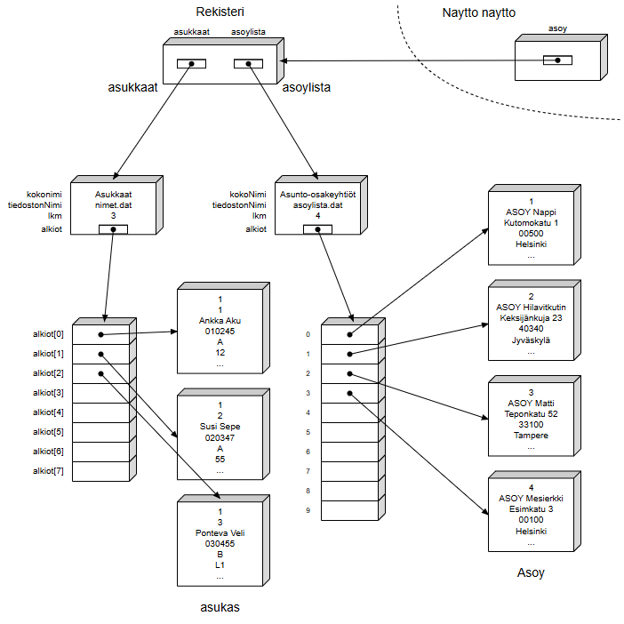

# Harjoitustyö ohjelmointi 2 -kurssille

## Ohjelma: ASOY-rekisteri
Kyseessä on fiktiivinen asunto-osakeyhtiön rekisteri, johon voidaan lisätä 
ja josta voidaan poistaa asukkaita ja asunto-osakeyhtiöitä. Lisäksi 
rekisteristä voidaan hakea ja hakutuloksien avulla rajata muun muassa 
asukkaita heille myönnettyjen pyykkitupa- ja saunaoikeuksien sekä nimen 
avulla. Ohjelma myös tarkistaa automaattisesti mm. henkilötunnuksen muodon 
oikeellisuuden.

Ohjelma on toteutettu Jyväskylän yliopiston ohjelmointi 2 -kurssin 
harjoitustyönä.

## Ohjelman tietorakenne

## Perustiedot
Ohjelmointikieli: Java

Visuaalinen toteutus: SceneBuilder

Viimeisin muutos: 26.4.2024
